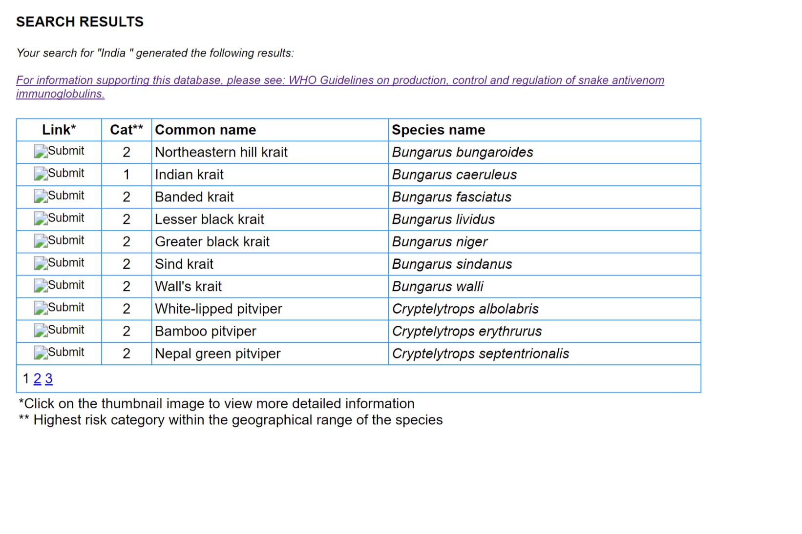

# Webscraping In R with RSelenium - Extracting Information from the WHO Snake Antivenom Database

## Making Excuses

Looking back at this post it seems a bit like how to draw an owl.


But! The complicated parts towards the end and are very much the specifics of to download the WHO database. What I wanted to share were the basics of RSelenium installation and use. Hopefully this helps you if you were thinking of doing something similar.

So if you're reading this not to get ideas of how to scrape with RSelenium, but instead to use the WHO Snake Database in R, I've put dataframes for snake species and country data into a package that you can download off github called snakes:

`devtools::install_github("callumgwtaylor/snakes")`

## Intro

Recently I was looking at the WHO Snake Antivenom Database in R, and had to use rvest and purrr from the tidyverse to get the information from the database in a tidy format. This worked well enough as each snake's information was in it's own page, in the same format each time. I've put it online [here](https://callumgwtaylor.github.io/blog/2018/01/27/new-package-in-development-snakes/)

My next aim was to extract the snake country data, looking at which snake species were present.

However, there was a problem. The information about a country's snakes would be split across multiple pages, with only ten snakes per page. The links to get through to the remainder of the snake info were little javascript links, and so there wasn't a particular URL I could tell rvest to go to. I couldn't work out if rvest could use any javascript, and it seemed like I needed to try a different approach. 

I needed a package that could load up a page, click through a javascript generated link, then download the information generated on that page. Turns out I needed RSelenium.

This post documents how I installed and used RSelenium to extract information from the WHO Snake Antivenom Database.  It's definitely not done in a "best practices" way, but it should allow you to get to a point where you're loading sites in RSelenium, and downloading the information for use in R.

## Installation

Basically:

- Selenium is a set of programming tools, a framework, that allows you to automate web browser actions.
- RSelenium is a R package that allows you to use your **seperate** installation of selenium inside R
- Docker is software that allows you to run an environment, where you will run selenium in

### What to install?

[Docker](https://www.docker.com/docker-windows)
[RSelenium](https://github.com/ropensci/RSelenium)

Also, this assumes that you're using RStudio and have some understanding of R. By some understanding I guess I mean, you may have to look up how to do things covered in [R for Data Science](http://r4ds.had.co.nz/) but most of the time when you read it, it makes sense.

## Getting it to work

So the workflow here is:

Docker is installed and running. In "Docker For Windows", you see an icon in the taskbar that you can hover over, and it should state "Docker is running"

In the terminal you start a docker container of the selenium chrome browser. Do this anyway you like. If like me you aren't really used to the terminal, you can get to it through RStudio (Terminal, NOT Console). Running:

`docker run -d -p 4445:4444 selenium/standalone-chrome`

Will set up the docker container we need.

If you then run:

`docker ps`

You should get print out of a table, containing info about the docker container that's just set up.

Once that's all working, the rest is back in R.

Load up RSelenium:

`library(RSelenium)`

And access our selenium browser using the RSelenium package:

```
remDr <- RSelenium::remoteDriver(remoteServerAddr = "localhost",
                                 port = 4445L,
                                 browserName = "chrome")
remDr$open()
```

Here what we're doing is creating an object in R that contains the information about the selenium browser we've created in a docker container. Then we're opening the browser.

## Using RSelenium Plus Rvest To Scrape The WHO database

So what we're going to do here is use RSelenium to identify and navigate to the correct page, then a mishmash of XML and Rvest to download the information on that individual page. Lastly we'll put everything we've done into a mix of functions, allowing us to use purrr to automate going through the entire site.

### Part One - Open Browser and Confirm We're At The Landing Page

```
# So we've loaded docker up already.
# In the terminal we've run: docker run -d -p 4445:4444 selenium/standalone-chrome

library(RSelenium)
library(rvest)
library(xml2)
library(tidyverse)

remDr <- RSelenium::remoteDriver(remoteServerAddr = "localhost",
                      port = 4445L,
                      browserName = "chrome")
remDr$open()

remDr$navigate("http://apps.who.int/bloodproducts/snakeantivenoms/database/SearchFrm.aspx") #Entering our URL gets the browser to navigate to the page

remDr$screenshot(display = TRUE) #This will take a screenshot and display it in the RStudio viewer
```


### Part Two - Selecting The Country Dropdown Menu, and Navigate To A Particular Country

Most articles I've read recommend using [Selector Gadget](http://selectorgadget.com/) to identify which part of a site you are trying to interact with. When it works, it works really well, but it didn't want to load on WHO Database.

Instead, I would right click on the page and use the "Inspect" option to identify the correct CSS path for RSelenium to use.


#### Creating A List Of Countries
```{r download_country_list}
snake_countries <- xml2::read_html(remDr$getPageSource()[[1]]) %>%
  rvest::html_nodes("#ddlCountry") %>%
  rvest::html_children() %>%
  rvest::html_text() %>%
  dplyr::data_frame(country_name = .)

snake_countries <- snake_countries %>%
  dplyr::mutate(list_position = 1:160,
                x = stringr::str_c("#ddlCountry > option:nth-child(",list_position, ")"))

# We chop off our first one as we are never going to navigate to there
snake_countries <- snake_countries[-1,]
```

So using the RSelenium `getPageSource()` function, and selecting the first element `remDr$getPageSource()[[1]]`, we can use `xml2::read_html()` to extract the html from the loaded page.

Using `rvest::html_nodes()` we've selected the chunk that we identified earlier with Inspect. Using `rvest::html_children()` we can extract attributes from the countries chunk, and then using `rvest::html_text()` we can extract a list of names of countries, which we turn into a column in a data_frame.

This data_frame is expanded with a column showing how far down the dropdown menu something is, plus a column "x". `x` is a bit more complicated. What we've done is created the css address for each option in the drop down menu using `stringr`. This address will be used later when we want to go to a specific country.

We chop off the first row in our new data_frame as it's some rubbish "Select country/territory" text that we don't need.


#### Navigating To A Specific Country

This can be done manually, using the addresses we've generated:

```{r load_india}
element<- remDr$findElement(using = 'css selector', "#ddlCountry > option:nth-child(65)")
element$clickElement()

# Printing 
html <- xml2::read_html(remDr$getPageSource()[[1]])
xml2::write_html(html, "india.html")
```

The new things we're doing here is navigating with RSelenium to a specific part of the dropdown menu, using the CSS address we've got for a particular item (India) and `findElement()`. Then simply clicking on it!

We can extract the html from the results and compare what we've got with what's seen on the official website.




So none of the prettiness, but all the information we wanted!

### Part Three - Finding The Seperate Pages Of Snakes

Using the inspect page in our new tab, it's clear that the name of the table we want is `SnakesGridView`. Every first table for countries where there are more than ten snakes, will also have twelve rows. That twelfth row (the reason we're talking about `tr:nth-child(12)` ) will contain the links to the subsequent pages. This was all found through rummaging with Inspect.

```{r india_page_two}
element <- remDr$findElement(using = 'css selector', "#SnakesGridView > tbody > tr:nth-child(12) > td > table > tbody > tr > td:nth-child(2)")
element$clickElement()
remDr$screenshot(display = TRUE)
```


### Part Four - Download One Country

Success!

Now there's just a couple of things left to do.

Download the snake information from the first page of a country profile and store it as a dataframe. Identify whether there is a second/third/fourth page for the profile. Go to these pages and download them.

Working out if a country have more than ten snakes or not is easy enough, thanks to the way they've been formatted. If a country has a single page, the html table created by rvest has four columns. If it has multiple pages, the html table has 6, as the links at the bottom mess things up. So we could put the multiple pages stuff statement.

This chunk below is a bit convoluted. I've tried to comment on it to make it clearer. The steps basically are:

- Load the country page
- Download the snakes table for that country (if there's only one page, that's all we need to do)
- Work out if there are more pages for the country
- If there additional pages then do the following:
- Work out the directions to get to the additional pages
- Write a function to download from a single additional page
- Use purrr::pmap to use those directions and the function to download all the additional pages
- Put all the additional pages for one country together.
- Reformat it so it looks the same as countries that just have one page

```{r extract_india}
# Then Extract The Snake Page
country_html <- xml2::read_html(remDr$getPageSource()[[1]])

# We download The Table For the First Page, and if there is only one page that's all we need to do!

country_table <- country_html %>%
  rvest::html_node("#SnakesGridView") %>%
  rvest::html_table(fill = TRUE)

# Then Determine If There Are More Pages
more_pages <- length(country_table) > 4

# Create a function to download the additional page's information

snake_country_secondary_download <- function(page_element){
  
  element <- remDr$findElement(using = 'css selector', page_element)
  element$clickElement()
  
  country_html <- xml2::read_html(remDr$getPageSource()[[1]])
  
  secondary_country <- country_html %>%
  rvest::html_node("#SnakesGridView") %>%
  rvest::html_table(fill = TRUE)
  
  secondary_country
}

# Put everything about these bigger pages in an if statement

if(more_pages == TRUE){
  # Then Work Out Exactly How Many More Pages - This is messy, I don't know why it cant go into a single html_node
  # but it seems to work this way and not the other way.

  country_table_number <- country_html %>%
  rvest::html_node("#SnakesGridView") %>%
  rvest::html_node("tbody > tr:nth-child(12)") %>%
  rvest::html_node("td") %>%
  rvest::html_node("table") %>%
  rvest::html_node("tr") %>%
  rvest::html_nodes("td") %>%
  length()
  
  # Create the links for these secondary pages
  country_pages <- dplyr::data_frame(
    page_number = 1:country_table_number,
    page_element = stringr::str_c("#SnakesGridView > tbody > tr:nth-child(12) > td > table > tbody > tr > td:nth-child(", page_number, ")"))
  
  country_pages <- country_pages[-1,]
  country_pages <- country_pages[,2]

    #country_pages left is the data_frame containing the address for the links for all the subsequent pages for each individual country
    
    #use purrr::pmap to run through each of the secondary pages with our function we created earlier. Then merge them all together
  secondary_country <- purrr::pmap(country_pages, download_secondary_country) %>%
  dplyr::bind_rows()
  
  # reformat these secondary pages, so they look the same as our pages where there's less than ten snakes

  country_table <- dplyr::bind_rows(country_table, secondary_country)
  country_table <- country_table[,1:4] %>%
    dplyr::filter(is.na(`Link*`))
}
```


### Step Five - Final Step - Automate To Download All Countries

This section below is then close to identical to the section above. We've got it to work for one country. Now we just need to put it into a function, to allow us to work through every country.

The arguments the function takes are the address of the country, the WHO ID of the country and the name of the country.

```
snake_country_download <- function(x, country_name){
  # Then Go To Our Country
  remDr$navigate("http://apps.who.int/bloodproducts/snakeantivenoms/database/SearchFrm.aspx") # First we load the databas
  element<- remDr$findElement(using = 'css selector', x)
  element$clickElement() #We'll need to create a way to insert the country into that child form
  
  # Then Extract The Snake Page
  country_html <- xml2::read_html(remDr$getPageSource()[[1]])
  
  country_table <- country_html %>%
    rvest::html_node("#SnakesGridView") %>%
    rvest::html_table(fill = TRUE)
  
  # Then Determine If There Are More Pages
  more_pages <- length(country_table) > 4
  
  if(more_pages == TRUE){
    # Then Work Out Exactly How Many More Pages
    country_table_number <- country_html %>%
      rvest::html_node("#SnakesGridView") %>%
      rvest::html_node("tbody > tr:nth-child(12)") %>%
      rvest::html_node("td") %>%
      rvest::html_node("table") %>%
      rvest::html_node("tr") %>%
      rvest::html_nodes("td") %>%
      length()
    
    # Then create a data frame, with new address from us to download these from
    country_pages <- dplyr::data_frame(
      page_number = 1:country_table_number,
      page_element = stringr::str_c("#SnakesGridView > tbody > tr:nth-child(12) > td > table > tbody > tr > td:nth-child(", page_number, ")"))
    
    country_pages <- country_pages[-1,]
    country_pages <- country_pages[,2]
    
    # Then use a secondary function to download these
    secondary_country <- purrr::pmap(country_pages, snake_country_secondary_download) %>%
      dplyr::bind_rows()
    
    # Then, for countries that we had to download multiple pages, merge them all together
    country_table <- dplyr::bind_rows(country_table, secondary_country)
    country_table <- country_table[,1:4] %>%
      dplyr::filter(is.na(`Link*`))
  }
  
  country_table <- country_table %>%
    dplyr::mutate(country_name = country_name)
  
  message(country_name)
  country_table
}
```

We lastly use `purrr::pmap()` one last time to work through the addresses of countries we've already created, using the download function we just made.

```
snake_country_data <- purrr::pmap(snake_countries, snake_country_download) %>%
  dplyr::bind_rows()

snake_country_data <- snake_country_data %>%
  dplyr::select(country_name, snake_category = `Cat**`, snake_common_name = `Common name`, snake_species = `Species name`)
```


### Resources, Links

I used a few pieces to work out how to do this:

[rvest article](https://blog.rstudio.com/2014/11/24/rvest-easy-web-scraping-with-r/)

[rvest and purrr talk](https://channel9.msdn.com/Events/useR-international-R-User-conferences/useR-International-R-User-2017-Conference/Scraping-data-with-rvest-and-purrr)

[the RSelenium vignettes](https://cran.r-project.org/web/packages/RSelenium/vignettes/RSelenium-basics.html)

If you think that there are ways I should do this differently please let me know on twitter (@callumgwt) or on the [github page for this package](https://github.com/callumgwtaylor/snakes).

#### Same Disclaimer As Last Time

Lastly, this is clearly not my data and I make no claims of ownership whatsover. The WHO are the copyright holders for any data, and whilst I think this package comes under acceptable use for research, please let me know if you’re someone from the WHO who disagrees.

Actually lastly, this data is extracted from the WHO database, but I am not making any claims about their accuracy, so this information should not be used to make any clinical decision on use of antivenom, or any similar decisions.
