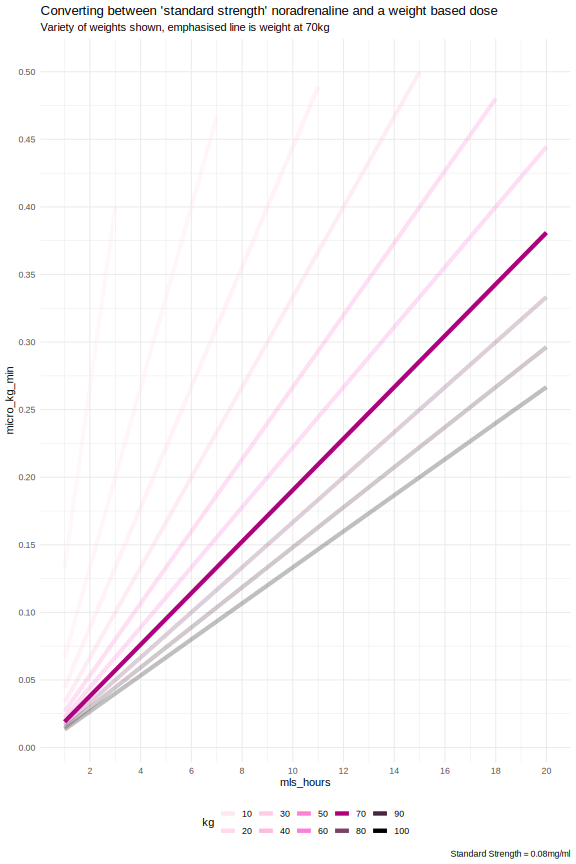
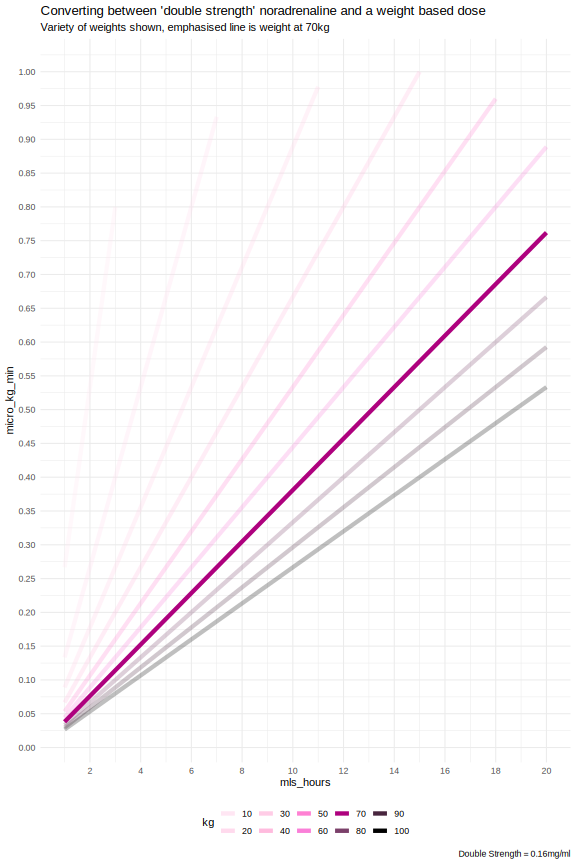

I created these plots for my own understanding, in working out equivalences between ml/hr of "standard doses" of adrenaline/noradrenaline in ICU, versus micro/kg/min used in other units.

The sizes of the images should mean they could be printed easily enough to A4

# Single Strength

# Double Strength

